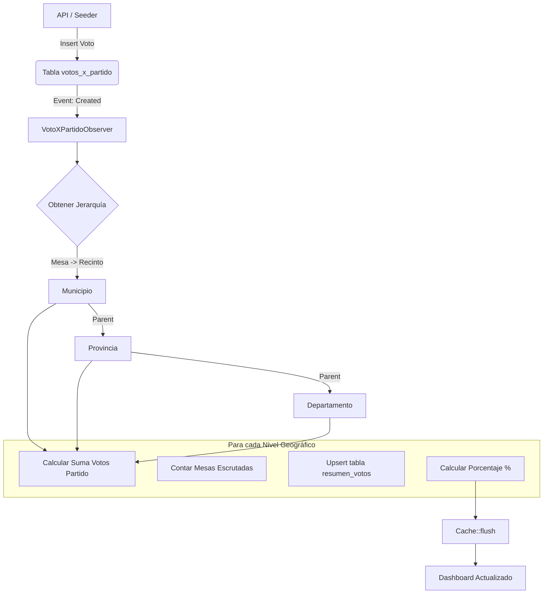

# 🧠 Nota Técnica: Observer de Votos (Cerebro del Dashboard)

## 1. El Problema
Originalmente, el cálculo de resultados (sumar votos por partido y geografía) se hacía dentro del `ActaController`. Esto tenía varios riesgos:
- **Acoplamiento:** Si registrábamos votos desde otro lugar (ej. Seeder, Importador Excel), el resumen no se actualizaba.
- **Rendimiento:** El controlador de Actas hacía demasiadas cosas (subir fotos, validar, guardar, calcular).
- **Mantenimiento:** Lógica de negocio mezclada con lógica HTTP.

## 2. La Solución: VotoXPartidoObserver
Implementamos un **Observer** que "escucha" cada vez que se crea o modifica un registro en la tabla `votos_x_partido`.

### ¿Cómo funciona?
1. **Disparador:** Al guardar un voto (`VotoXPartido::create`), el Observer se activa automáticamente.
2. **Contexto:** Identifica a qué Acta pertenece el voto y, por ende, a qué Mesa y Geografía (Recinto -> Municipio).
3. **Cascada:** Recorre la jerarquía geográfica hacia arriba (Municipio -> Provincia -> Departamento).
4. **Cálculo:**
   - Suma los votos para ese partido en esa geografía.
   - Cuenta las mesas escrutadas.
   - Actualiza la tabla `resumen_votos` (Upsert).
   - Calcula el porcentaje de votos en tiempo real.
5.  Limpia la caché de Redis para que el mapa refleje los cambios al instante.

## 3. Diagrama de Flujo



## 4. Código Clave

El corazón de la lógica utiliza `updateOrInsert` para ser atómico y eficiente, y `DB::raw` para cálculos matemáticos directos en SQL.

```php
// C. Actualizar o Crear el resumen
DB::table('resumen_votos')->updateOrInsert(
    [
        'id_geografia' => $geo->id_geografia,
        'id_cargo' => $acta->id_cargo,
        'id_partido' => $voto->id_partido,
    ],
    [
        'total_votos' => $totalVotos,
        'total_mesas_escrutadas' => $totalMesas,
        'ultima_actualizacion' => now(),
    ]
);
```
